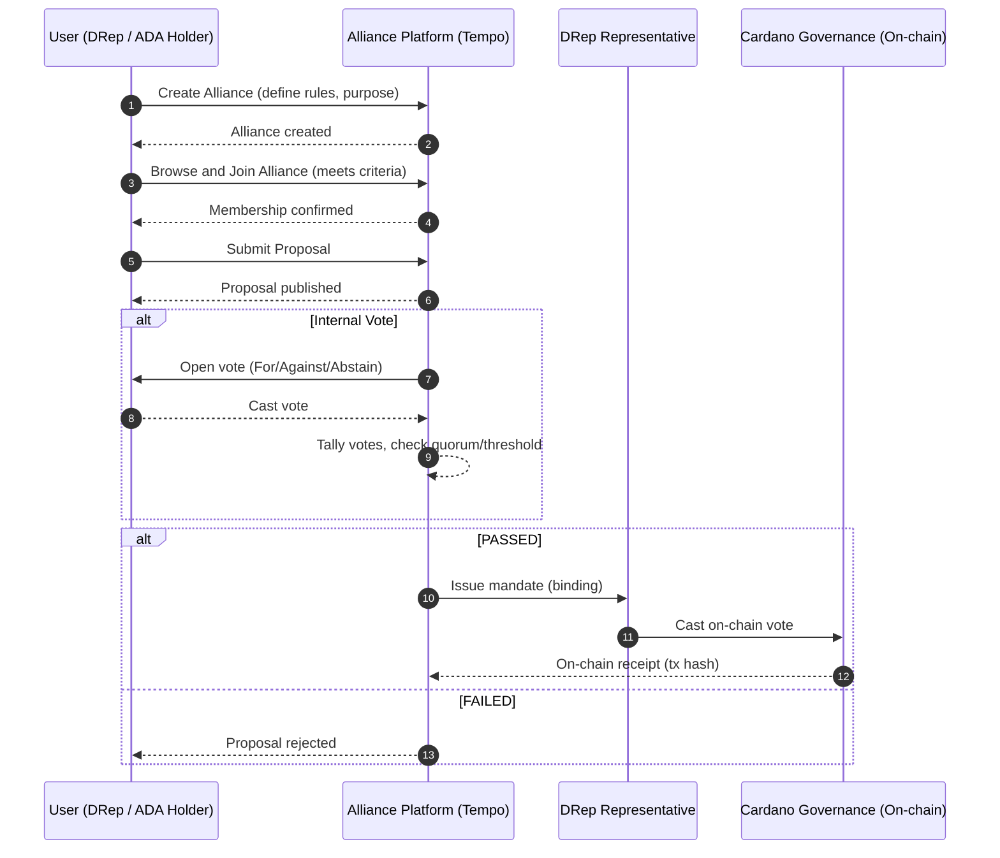
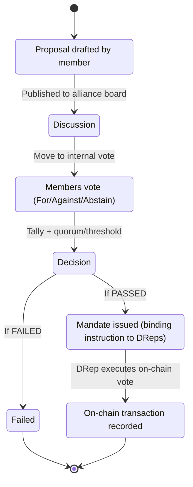

# UX User Flow – Multi-Party Alliance (Tempo)

This document describes the core user flow of the **Multi-Party Alliance** feature, as defined in the Catalyst proposal.  
The scope is limited to alliance creation, membership, proposal submission, internal voting, and execution of mandates on-chain.  
This satisfies the **acceptance criteria** of M1: UX/UI design documentation is available and traceable in the repository, and can serve as **evidence** for delivery.

---

## 1. Sequence Diagram – User Interactions

## 2. State Diagram – Proposal Lifecycle

